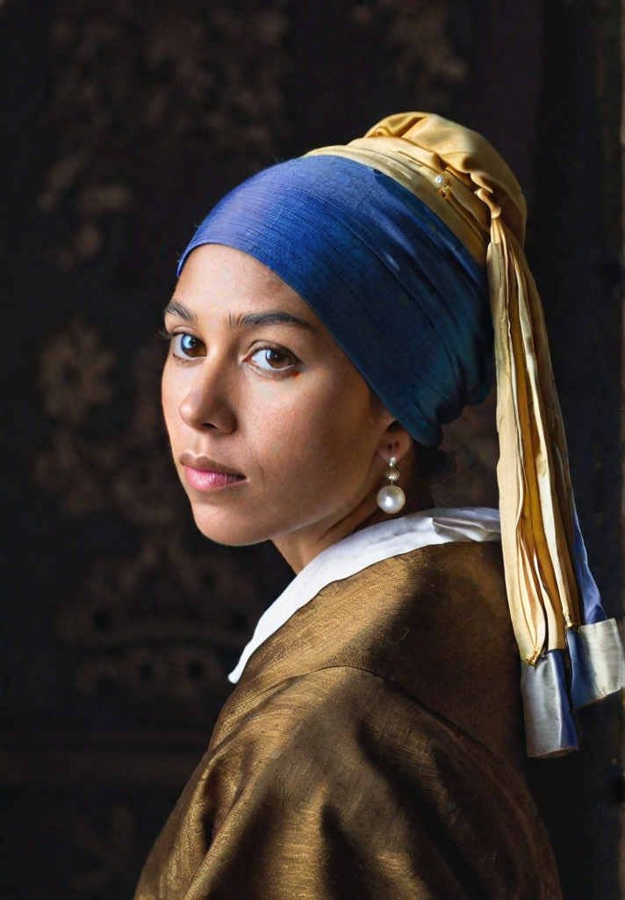

# SG161222/RealVisXL_V1.0 img2img Cog model

This is an implementation of the [SG161222/RealVisXL_V1.0](https://huggingface.co/SG161222/RealVisXL_V1.0) as a Cog model. [Cog packages machine learning models as standard containers.](https://github.com/replicate/cog)

First, download the pre-trained weights:

    cog run script/download-weights

Then, you can run predictions:

    cog predict -i image=@demo.jpg -i prompt="a latina woman with a pearl earring"

## Example:

"a latina woman with a pearl earring"

